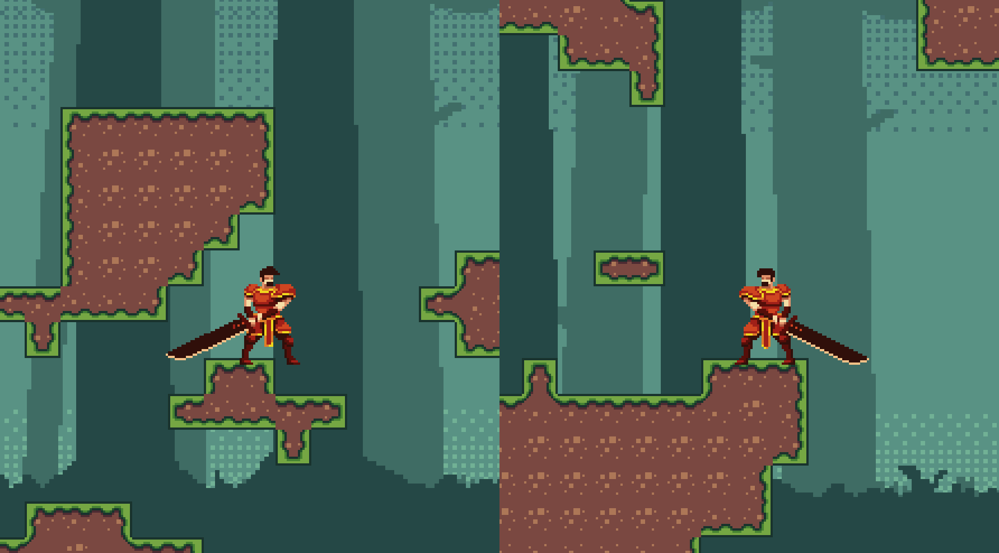
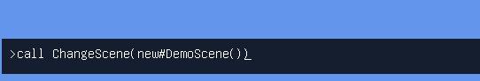

    

<h1 align="center"> Calamity Engine </h1>
<p align="center" style="background-color:#0C0C0C">
    
</p>


## Table of Contents
- [Introduction](#introduction)
- [Features](#features)
- [Getting Started](#getting-started)
  - [Prerequisites](#prerequisites)
  - [Installing MonoGame](#installing-monogame)
  - [Download](#Download)
  - [Accessing the Demo Scene](#accessing-the-demo-scene)
- [Notes](#notes)
  - [Low Level Framework](#low-level-framework)
  - [Mid Level Framework](#mid-level-framework)
  - [(Deprecated) High Level Framework](#deprecated-high-level-framework)
  - [(New) High Level Framework](#new-high-level-framework)
  - [Command Line](#command-line)
    - [Call](#call)
- [Usage](#usage)
- [Documentation](#documentation)
- [Roadmap](#roadmap)
- [License](#license)
    - [Assets and Acknowledgements](#assets-amd-acknowledgements)


 

## Introduction
Welcome to **Calamity Engine**, my personal hobby project, a game engine under work. It is designed to handle 2D pixelized action-platformer games (though the action hasn't been implemented yet \:\) ).

As a hobby project, developed by someone, with no professional experience in the game development industry, to anyone looking for a MonoGame/XNA based engine for 2D games to code with, I would advise to check out other projects:
 - [Nez Engine](https://github.com/prime31/Nez)
 - [MonoFox](https://github.com/Martenfur/Monofoxe)
 - or build your own! (Half the fun in my opinion)

This repo was maintained privately in GitLab until now. 
The main reason for publishing this is that one might learn from my mistakes and successes.
I would put the old Actor/Solid class implementations and some bloated and ugly code due to the feature creep as examples of the former, and the start of the UI implementation as examples of the latter.

I only tend to update this project in my spare time during breaks, thus the development is uneven. My plans for this engine for now are mostly to use as a learning experience (maybe develop a game using it later), but this might change.

The engine uses some of MonoGames features and implements parts of the code (either in part or fully) of:

- Monocle Engine from Maddy Thorson
- The [player class](https://github.com/NoelFB/Celeste/blob/master/Source/Player/Player.cs) from the game Celeste 

(Check [License](#license) for relevant licensing information.)

## Features
- Very powerful [command line tool](/Util/Commands.cs)
- Various [utility functions](/Util)
- Support for maintaining multiple [Scenes](/Scene.cs)
- Multiple [Camera](/Graphics/Camera.cs) support
- Low level game framework (ex.: [Components](Component.cs),[DrawableComponents](/Graphics/DrawableComponents.cs), [SpriteRenderer](SpriteRenderer.cs))
- Mid level game framework (ex.: [Sprite Components](/Graphics/SpriteGameComponent.cs)), [Animated Components](/Graphics/AnimatedGameComponent.cs), [Colliders](/Collision/Collider.cs))
- High level game framework (Under overhaul)
- [Tag system](/Tags/ITags.cs)) for components 
- Handling [Particle Systems](/Particles/ParticleSystem.cs)
- Support for tilemaps
- Demo/Testing scene and objects


## Getting Started

While the engine is not ready for use, you can try it out.
I recommend using Visual Studio for this purpose, as it is well supported by MonoGame.


### Installing MonoGame
To install MonoGame, follow the instructions on the relevant [MonoGame website](https://docs.monogame.net/articles/getting_started/1_setting_up_your_development_environment_windows.html)

### Download
To get a local copy, either download the repository or (if you have git) use the following command:

1. **Clone the Repository**
    ```sh
    git clone https://github.com/adamsch60/Calamity-Game-Engine
    cd Calamity-Game-Engine
    ```


 

### Accessing the Demo Scene

When starting the code as-is, as no [Scene](/Scene.cs) is provided to the engine at start, it starts with an empty Scene.

Regardless, to check out the [DemoScene](/Demo/DemoScene.cs), you can use the command line.

1. Open the command line with any of the buttons  <kbd>Esc</kbd>,<kbd>+</kbd>,<kbd>5</kbd>(On the numpad)
2. Type 
  ```c#
  call ChangeScene(new#DemoScene())
  ```
  (ChangeScene is the function for loading a scene, we use "new#" to create an object instead of "new " for reasons in the command line interpretation, I plan to change this later.)
  
  

3. 3. Explore the scene!

The Demo scene currently is a scene for testing and demoing the features of the engine. The current scene has been modified to only rely on free assets licensed such that I could redistribute them as part of this demo (see the [license](#license) section for complete attribution).

## Notes
While this project won't have a high-level documentation for a while, due to the big changes implemented (a low level documentation is maintained as docstrings), here I will write a few details about certain features.

### Low level Framework
The low level framework of the engine is similar to the MonoGame default implementation. Examples of some features are:
- **Scenes**: Each scene manages a separate list of components and cameras. They can implement logic specific to the scene. At any time there is exactly one active scene.
- **Components**: Components of an active scene have their Update function called each tick, to update them in terms of game logic.
- **Drawable Components**: Drawable components also have their Draw function called each tick, for drawing them to the screen.

### Mid level Framework
The mid level framework of this engine consists of helper classes designed to handle small and concrete functions. Examples of some of them are:
- **Sprite Components**: Sprite components maintain drawing a sprite at their location. They handle various effects as well.
- **Animated Components**: Animated components are Sprite Components that change their sprite to display an animation. The speed and the position can be controlled.
- **Colliders**: Colliders are used to handle hitboxes and collisions. They are used to implement more complex game logic.

### (Depricated) High level Framework
Originally the high level framework of the engine was designed to be based on separate different components based on physics, each handling other game components, to represent a character in game. Each such component had to be handled inside these classes, very similarly for each. Thus, both the code and its implementation had much needless repetition, which led me to rewrite this part.
These classes are still present in the codebase but are being gradually replaced by Character.

The classes are:
- **Solids**: Solids represent objects like moving platforms in games. They can move, and don't collide with other solid objects, but can push, squish or carry other objects.
- **Actors**: Actors represent dynamically moving objects, like players or enemies in platformer games, they collide with solids, but can't collide with other actors.
- **Jumpthrough**: JumpThroughs are like solid objects but one may jump through them (only upwards).

Each of these classes has its associated animated component and collider.

### (New) High level Framework
Characters are a more conventional way of handling game objects. A character has a set of character components handling each relevant function for an object. Thus, while defining a character we don't need to interact with lower level objects directly.

An important remainder of the previous system is the Mover character component. Only the active mover may directly move a character. Each previous physics type has its associated mover.

There are dedicated character components for handling:
- Movers (Actors, Solids)
- Sprites and Animations
- Audio
- Speed, gravity and friction
- Particle systems
- Managing character statistics buffs and debuffs

One can also make a Character part of another character with the SubCharacter component.


### Command Line
The currently implemented command line tool is loosely based on the command line in the Monocle engine, but much of the features changed (Most importantly the scripting support by the call command).

The command line allows calling static functions with the custom attribute `[Command(name,help)]` where `name` and `help` are strings for the name of the command and the help string. To get a list of commands, use the `help` command.

The command line handles scrolling, command history, tab-completion (even using `call`).

#### Call

The `call` command is maybe the most important to detail. It allows to execute C\# code runtime, or even attach basic functions to events with the delegate functionality of C\#. This relies on System.Reflection, and processes your string while executing it.

Due to the way the command line currently handles command inputs, for now, one can't use spaces in the code (the command line would process the parts as different inputs). As the only place this is really relevant is with the `new` keyword, use `new#` until this is resolved.

Most operators are implemented, but sadly, due to how C\# is handling operator overloads, the square bracket operator `[i]` does not work in the command line. For different objects, one might use the `Get(i), Set(i,value)` or `get_Item(i),set_Item(i,value)` functions. Passing references also won't work due to how reflection is implemented.

Code is always executed as if from the class [Game](/Game.cs). Your code may access all variables that exist in the game, even if private (Though one can't change constant or readonly variables).

To find all members of an object, you can type `object.@`. This displays all members (possibly with multiplicity) of the object.

For testing purposes, there is a Commands.Variables list of objects implemented, that one might use for storage. There is the function 
```c#
AddFunctionKeyActions(i,code)

```
That adds to <kbd>Fi</kbd> the same functionality as using the `call` command with the string (still use no space for this). This relies on the function 
```c#
callDelagate(code)
```
creating an action delegate for the same command. By using the `Actions.Reduce` functions in [/Util/Tools.cs](/Util/Tools.cs), this can be formed to any action delegate (by contravariance) and added to any event listener.


## Usage

### Creating a Game
Currently, this engine is not yet suitable for making games. The plan for the final parts of creating a game is the following (this is likely to change during the development):

- **Create a Game object**
This will manage all variables and concepts shared along scenes (like settings, inventory, player stats, save data)
- **Create Scene objects for your game**
These will manage what the player sees in each scene. It loads the map, the characters in the scene, and handle story based game logic (ex.: cut scenes, doors).
- **Create Characters for your game**
These are all of the game objects you interact with, enemies, parts of the map, traps or obstacles.
- **Create UI for your game**
This is mostly separate from the other process. Create the UI, window by window with the UI classes.

## Documentation
While high level documentation is not planned, the entire code base uses docstrings, describing the actions and the purpose of any function or class.

## Roadmap
Currently, the issues (due to size and numerosity) are tracked in the source files as TODO-s. As the project grows, this will likely change to using the GitHub issue tracker feature.

The current plan for the engine includes the following:
- [***Under way***] Going through the current TODO-s
- [***Planning done***] Adding an ability/skill manager system
- Implementing a basic AI system (finite state machine based)
- Streamlining Character, Ability and map creation (maybe even with dedicated editors)
- Producing a complete demo game

## License
The current version is distributed under the license GPL-3.0-or-laterlicense. See [LICENSE](/Licenses/LICENSE.txt) for more information.

### Assets and Acknowledgements
- [[MIT License](/Licenses/MIT-LICENSE-Monocle.txt)] Monocle Engine from Maddy Thorson
- [[MIT License](/Licenses/MIT-LICENSE-Celeste.txt)] The [player class](https://github.com/NoelFB/Celeste/blob/master/Source/Player/Player.cs) from the game Celeste
- [[CC BY 4.0 License](https://creativecommons.org/licenses/by/4.0/)] [Farmer Story Asset Pack](https://alpatyk.itch.io/free-asset-farmer-story-sprites-and-backgrounds?download) © by Alpatyk
- [[CC BY 4.0 License](https://creativecommons.org/licenses/by/4.0/)] [Fire Knight Sprite](https://chierit.itch.io/elementals-fire-knight) © by Chierit
- [[GPL-2.0-or-later License](https://unifoundry.com/LICENSE.txt)] Unifont font
